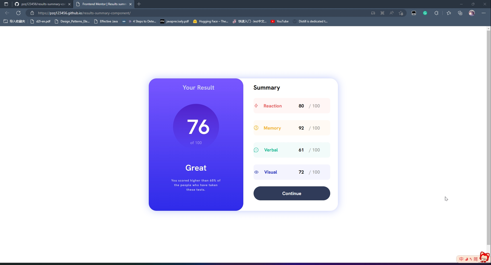

# Frontend Mentor - Results summary component solution


This is a solution to the [Results summary component challenge on Frontend Mentor](https://www.frontendmentor.io/challenges/results-summary-component-CE_K6s0maV).

## Table of contents

- [Frontend Mentor - Results summary component solution](#frontend-mentor---results-summary-component-solution)
  - [Table of contents](#table-of-contents)
  - [Overview](#overview)
    - [The challenge](#the-challenge)
    - [Screenshot](#screenshot)
    - [Links](#links)
  - [My process](#my-process)
    - [Built with](#built-with)
    - [What I learned](#what-i-learned)
  - [Author](#author)
  - [problems](#problems)

## Overview
I am using `Vue` to structure this project and using `Vite` to build it. The preview page is deployed on GitHub Pages. You can visit it [here](https://pzq123456.github.io/results-summary-component/).

### The challenge

Users should be able to:

- View the optimal layout for the interface depending on their device's screen size
- See hover and focus states for all interactive elements on the page

### Screenshot

### Links

- Solution URL: [Results-summary-component](https://github.com/pzq123456/results-summary-component)
- Live Site URL: [Demo page](https://pzq123456.github.io/results-summary-component/)

## My process
- whole design:

- * `flex` is used to lay out the page.
- * This page has "left-card" and "right-card". 
- * Two part mentioned above is wrapped by a "wrapper" `div`.
- right design:
- * Four "dataBar"s are generated by `v-for` command, and their style is controlled by `v-bind` command. 


### Built with

- Semantic HTML5 markup
- CSS custom properties
- Flexbox
- [vue.js](https://vuejs.org/) - JS library


### What I learned
  1. I learned how to use `v-for` and `v-bind` to generate elements and control their style. 

  ```html
   <div class="card-right">
      <h2>Summary</h2>
      <div v-for=" (data, index ) in dataList" :key="data.category" class="dataBar" :style="colors[index]">
          <!-- img with path of data.icon -->
          <div class="icon" >
              
          </div>
          <h3 :style="TextColors[index]">{{data.category}}</h3>
          <div class="score-end">
              <span class="strong">{{data.score}}</span>
              <span class="weak">/ 100</span>
          </div>
      </div>
      <button>Continue</button>
  </div>
  ```

## Author

- Website - [pzq123456](https://github.com/pzq123456)
- Frontend Mentor - [@pzq123456](https://www.frontendmentor.io/home)

## problems 
- I have a problem with the "SVG" icons in the build stage.
- * Solve: I put the icons in the `public` folder and use the hard-code (http//.../*.svg) path in `src` to load them. 

> HELP ME:
> * I think this is not a good way to solve this problem.
> * If you have any good idea, please tell me in the [issue](https://github.com/pzq123456/results-summary-component/issues) part of my project.

> Thank you very much!

